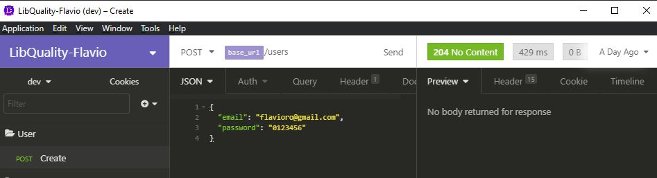
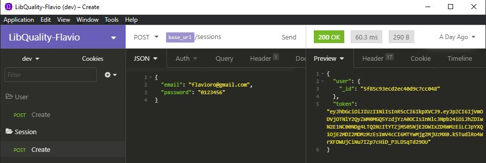
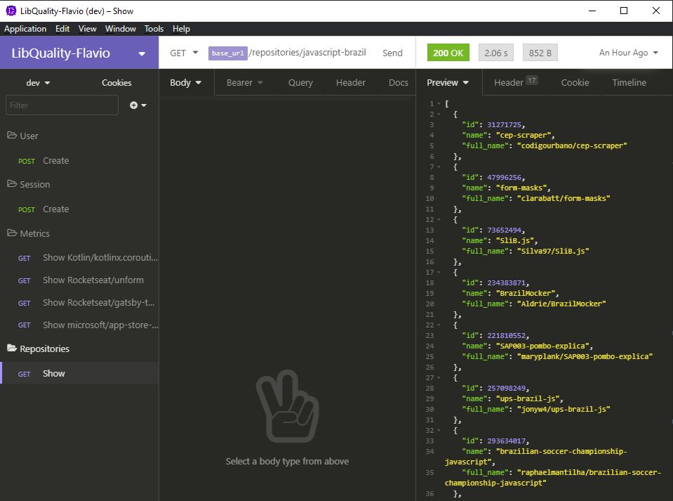
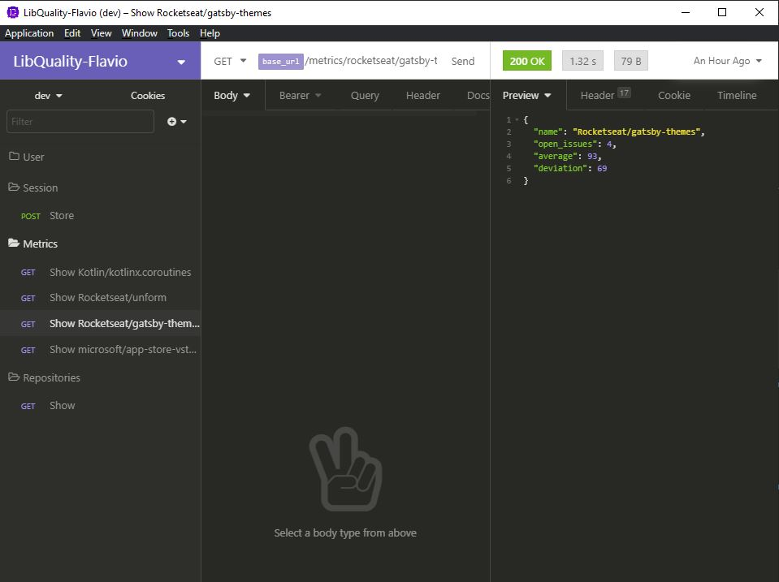

# 📈 Metrics GitHub API

[](https://github.com/flavioro/metrics-github/actions)
[](https://mongoosejs.com/)
[](https://eslint.org/)
[](https://jestjs.io/)
[](https://codecov.io/gh/flavioro/metrics-github)
[](https://github.com/flavioro/metrics-github/blob/master/LICENSE)
[](http://makeapullrequest.com)<br>
[](https://insomnia.rest/run/?label=metrics-github&uri=https://github.com/flavioro/metrics-github/blob/master/Insomnia_2020-10-13-Flavio.json)

## 🏷️ ABOUT


NodeJs - Backend - MetricsGitHub will collect metrics from GitHub projects and make them available in a consolidated dashboard. End users can query by Project name (like “React”) then they will see a #issues, average, and standard deviation time. App MetricsGitHub use JWT authentication.

Allow users to search by project name and check issues status like opened issues, average days opened and deviation. The app use JWT to logins, validation, also a simple versioning was made.

## Table of Contents


- [Requirements](#Requirements)
- [Installing](#installing)
  - [Configuring](#configuring)
    - [Database](#Database)
- [Usage](#usage)
- [Testing-Jest-Routes](#Testing-Jest-Routes)
  - [Test Jest](#Test-Jest)
  - [Test Routes](#Test-Routes)
    - [Example_User](#Example-User)
    - [Example Repository GitHub](#Example-Repository-GitHub)
- [Future improvements](#Future-improvements)
 - Refactoring, complete all tests, test unit, test integration and test end to end

# Requirements: - 🚀 Technologies used


[VS Code - Visual Studio Code] (https://code.visualstudio.com/download)<br/>
[npm] (https://www.npmjs.com/get-npm)<br/>
[Node.js 10+] (https://nodejs.org/en/download/)<br/>
[MongoDB] (https://docs.mongodb.com/manual/administration/install-community/)<br/>
[Optional Docker] (https://docs.docker.com/get-docker/) - Docker is a tool designed to make it easier to create, deploy, and run applications by using containers, I use and recommend.<br/>
[GitHub] (https://git-scm.com/downloads)<br/>

# Installing


Getting a Git Repository [Link](https://git-scm.com/book/en/v2/Git-Basics-Getting-a-Git-Repository) - example.

```
$ npm install
```

> Testing your application is part of the development. [`eslint`](https://eslint.org/) and [`prettier`](https://prettier.io/) I use it as a pre-test and also typescript to keep the code clean and patterned.

## Configuring

- 🌐 Environment variables
env file. It's actually a simple configuration text file that is used to define some variables you want to pass into your application's environment. Rename file `.env.example` to `.env`
.env(https://github.com/motdotla/dotenv)

| key                 | description                                                                                                                                                                           | default      |
| ------------------- | ------------------------------------------------------------------------------------------------------------------------------------------------------------------------------------- | ------------ |
| APP_PORT            | Port number where the app will run.                                                                                                                                                   | `3333`       |
| GITHUB_TOKEN            | A personal token for GitHub access, it **is necessary**                                                                                                                                                  | `token-created`       |
| GITHUB_API            | API to GitHub access                                                                                                                                                    | `https://api.github.com`       |
| JWT_SECRET          | A alphanumeric random string. Used to create signed tokens.                                                                                                                           | -            |
| JWT_EXPIRATION_TIME | How long time will be the token valid. See [jsonwebtoken](https://github.com/auth0/node-jsonwebtoken#usage) repo for more information.                                                | `7d`         |
| MONGO_DB            | Database name.                                                                                                                                                                        | `metricsGithub` |
| MONGO_HOST          | MongoDB host. For Windows users using Docker Toolbox maybe be necessary in your `.env` file set the host to `192.168.99.100` (docker machine IP) instead of localhost or `localhost`. | `localhost`  |
| MONGO_PORT          | MongoDB standard port.                                                                                                                                                                         | `27017`       |


To create a personal access token in GitHub [link](https://docs.github.com/en/free-pro-team@latest/github/authenticating-to-github/creating-a-personal-access-token) is required to use the app metrics-github.


### Database

The motivation of the MongoDB language is to implement a data store that provides high performance, high availability, and automatic scaling. MongoDB is extremely simple to install and implement. MongoDB uses JSON or BSON documents to store data.

Or use docker to mongoDB
```
$ docker run --name metrics-github-mongo -d -p 27017:27017 mongo
```


# Usage

To start up the app run:

```
npm run dev:server
```

# Testing-Jest-Routes


[Jest](https://jestjs.io/) is a delightful JavaScript Testing Framework with a focus on simplicity.

It works with projects using: Babel, TypeScript, Node, React, Angular, Vue and more!


## Test Jest

To run:

```
$ npm run test
```

## Test Routes

To test the routes, you can use the [Insomnia](https://insomnia.rest/). The whole workspace this API is available for use, just download the file Insomnia_2020-10-13-Flavio.json in project root.

If desired, use another way to perform as requests, as available routes are:

**`POST http://localhost:3333/v1.0/users`** - Created user.<br/>
**`POST http://localhost:3333/v1.0/sessions`** - Generates user token.<br/>
**`GET http://localhost:3333/v1.0/metrics/:user/:repository`** - Average Statistics Libs Issues.<br/>
**`GET http://localhost:3333/v1.0/repositories/:name_search`** - Collect Data From GitHub.<br/>

### Example User

- `POST /users`

Request body:

```json
{
  "email": "flavioro@gmail.com",
  "password": "123456"
}
```



- `POST /session`

Request body:

```json
{
  "email": "flavioro@gmail.com",
  "password": "123456"
}
```


### Example Repository GitHub

- `GET /repositories/javascript-brazil`

```json
[
  {
    "id": 31271725,
    "name": "cep-scraper",
    "full_name": "codigourbano/cep-scraper"
  },
  {
    "id": 47996256,
    "name": "form-masks",
    "full_name": "clarabatt/form-masks"
  },
  {
    "id": 73652494,
    "name": "SliB.js",
    "full_name": "Silva97/SliB.js"
  },
  {
    "id": 234383871,
    "name": "BrazilMocker",
    "full_name": "Aldrie/BrazilMocker"
  },
```


- `GET /metrics/rocketseat/gatsby-themes`

```json
{
  "name": "Rocketseat/gatsby-themes",
  "open_issues": 4,
  "average": 93,
  "deviation": 69
}
```



# Future improvements

- Due to time, I was unable to complete all tests, unit tests, integration tests and end-to-end testing. <br/>

- Refactoring: Improving the pattern of existing code, always with clean code, design patterns already used. <br/>

- I liked to implement this API, I intend to add new search metrics soon, to know the most used ones:
  - Racking by Programming languages;
  - Racking by Libraries used in the projects, reading information from the package.json file;
  - Racking by stars;
  - Racking by Forks;
  - Racking by Watching;
  - Racking by Contributors;


Developed by Flavio Rodrigues 🌝
